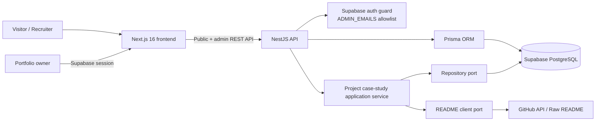
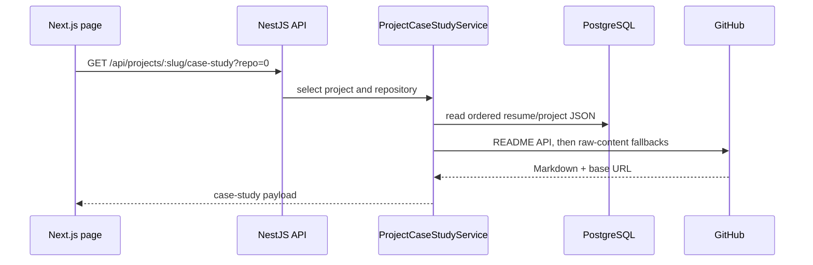

<div align="center">

  

  # Full-Stack Developer Portfolio

  <p>A production-oriented portfolio with a public resume, authenticated CMS, GitHub-powered case studies, and a recruiter contact workflow.</p>

  <p>
    <a href="https://www.nguyentrananhkhoa.id.vn/"></a>
    <a href="https://portfolio-api-fna4.onrender.com/api/health"></a>
  </p>

  <p>
    
    
    
    
    
    
    
  </p>

</div>

<br />

---

## Table of contents

- [Overview](#overview)
- [Key features](#key-features)
- [Architecture](#architecture)
- [Technology](#technology)
- [Repository structure](#repository-structure)
- [Quick start](#quick-start)
- [Environment variables](#environment-variables)
- [API overview](#api-overview)
- [Quality checks](#quality-checks)
- [Deployment](#deployment)
- [Roadmap](#roadmap)

---

## ✨ Overview

This monorepo powers an English-language portfolio for a Full-Stack Developer Intern. Content is stored as structured JSON rather than raw HTML, so the public resume, live editor preview, print view, and version history all share the same validated data model.

The project is deliberately split into a Next.js frontend and a NestJS API. Supabase provides authentication and PostgreSQL; Prisma owns database access. Public project case studies are loaded server-side from configured public GitHub repositories, which prevents browser CORS issues and keeps GitHub retrieval isolated from the UI.

## 🚀 Key features

- **Public portfolio and resume** — responsive home page, printable resume, and public resume URLs by slug.
- **Authenticated resume CMS** — Supabase Bearer-token authentication with an `ADMIN_EMAILS` allowlist; create, duplicate, edit, publish, select primary, and delete resume profiles.
- **Versioned publishing** — every publish creates a `ResumeVersion` snapshot; an admin can inspect history and roll back safely.
- **Structured content** — React Hook Form and Zod validate resume JSON before it is rendered by the frontend.
- **GitHub-backed project case studies** — multi-repository selection; server-side GitHub API lookup with raw-content fallbacks for `main`, `master`, and `HEAD` README files.
- **Safe Markdown rendering** — GitHub Flavored Markdown, syntax highlighting, Mermaid diagrams, responsive images, inline badges, and repository-relative asset URLs.
- **Contact and JD intake** — a visitor can send an email, a message, a JD URL, or a JD file; the API validates input, applies anti-spam protections, and persists the request.
- **Production deployment** — frontend on Vercel; NestJS API on Render with a health check and Prisma migration at startup.

## 🏗️ Architecture



### Case-study request flow



The case-study feature follows a small Clean Architecture boundary: the application service depends on repository and README-client interfaces, while Prisma and GitHub HTTP implementations live in infrastructure. This makes the selection logic straightforward to unit test without a database or network request.

## 🧰 Technology

| Area | Technologies |
| --- | --- |
| Frontend | Next.js 16, React 19, TypeScript, Tailwind CSS |
| Forms and validation | React Hook Form, Zod |
| Markdown and diagrams | react-markdown, remark-gfm, rehype-highlight, Mermaid |
| Backend | NestJS 11, TypeScript, REST |
| Data | Supabase PostgreSQL, Prisma 7 |
| Authentication | Supabase Auth and a NestJS guard |
| Tooling | pnpm workspace, ESLint, Prettier, Jest |
| Hosting | Vercel, Render, Supabase |

## 📁 Repository structure

```text
portfolio/
├── frontend/                         # Next.js App Router application
│   └── src/
│       ├── app/                      # Public, resume, project, and admin routes
│       ├── features/
│       │   ├── home/                 # Landing-page contact workflow
│       │   ├── projects/             # GitHub README case-study renderer
│       │   └── resume/               # Public resume and editor UI
│       └── lib/                      # Supabase, image URL, and UI helpers
├── backend/                          # NestJS API
│   ├── prisma/                       # Database schema and migrations
│   └── src/
│       ├── auth/                     # Supabase guard and authenticated request type
│       ├── contact/                  # Contact/JD endpoint
│       ├── prisma/                   # Prisma service and module
│       └── resume/
│           ├── application/          # Project case-study use case + tests
│           ├── domain/               # Dependency ports and contracts
│           ├── infrastructure/       # Prisma repository and GitHub README client
│           └── dto/                  # Request validation DTOs
├── render.yaml                       # Render API deployment definition
├── start-dev.bat                     # Windows development helper
└── pnpm-workspace.yaml               # Workspace packages
```

## 🏁 Quick start

### Prerequisites

- Node.js `22.14+`
- pnpm `11.13+`
- A Supabase project with PostgreSQL and Auth enabled

### Install and configure

```bash
git clone <your-repository-url>
cd portfolio
pnpm install

# Create these files from the examples in the repository.
cp backend/.env.example backend/.env
cp frontend/.env.example frontend/.env.local
```

Set the required values, generate Prisma Client, then start both applications:

```bash
pnpm --filter backend db:generate
pnpm dev
```

The frontend runs at `http://localhost:3000`; the API health endpoint is `http://localhost:3001/api/health`.

On Windows, `start-dev.bat` runs the same workspace development command.

## 🔐 Environment variables

### Backend — `backend/.env`

| Variable | Purpose |
| --- | --- |
| `DATABASE_URL` | Supabase PostgreSQL pooled connection URL used at runtime |
| `DIRECT_URL` | Direct PostgreSQL URL used by Prisma migrations |
| `CORS_ORIGIN` | Allowed frontend origin, for example `http://localhost:3000` |
| `SUPABASE_URL` | Supabase project URL |
| `SUPABASE_PUBLISHABLE_KEY` | Supabase publishable/anon key used to validate sessions |
| `PORTFOLIO_OWNER_ID` | Supabase Auth UID that exclusively owns the public portfolio CV |
| `ADMIN_EMAILS` | Comma-separated email allowlist for CMS access |

### Frontend — `frontend/.env.local`

| Variable | Purpose |
| --- | --- |
| `NEXT_PUBLIC_API_URL` | API base URL; defaults to `http://localhost:3001/api` |
| `NEXT_PUBLIC_SUPABASE_URL` | Supabase project URL available to the browser client |
| `NEXT_PUBLIC_SUPABASE_PUBLISHABLE_KEY` | Browser-safe Supabase publishable/anon key |

Never commit real credentials, service-role keys, or production database URLs.

## 🔌 API overview

### Public routes

| Method | Route | Purpose |
| --- | --- | --- |
| `GET` | `/api/health` | API health status |
| `GET` | `/api/resume` | Primary published resume |
| `GET` | `/api/resume/:slug` | Published resume by slug |
| `GET` | `/api/projects/:slug/case-study?repo=<index-or-label>` | Markdown-backed project case study |
| `POST` | `/api/contact` | Contact message and optional JD submission |

### Admin routes

These routes require a valid Supabase Bearer token and an email in `ADMIN_EMAILS`.

| Method | Route | Purpose |
| --- | --- | --- |
| `GET` / `POST` | `/api/admin/resumes` | List or create/duplicate profiles |
| `GET` / `PUT` / `DELETE` | `/api/admin/resumes/:id` | Read, save, or delete a profile |
| `PUT` | `/api/admin/resumes/:id/meta` | Update title and slug |
| `POST` | `/api/admin/resumes/:id/publish` | Publish and create a version snapshot |
| `POST` | `/api/admin/resumes/:id/set-primary` | Set the primary profile |
| `GET` | `/api/admin/resumes/:id/versions` | View version history |
| `POST` | `/api/admin/resumes/:id/rollback/:versionId` | Restore a version |

Backward-compatible primary-resume endpoints remain under `/api/admin/resume`.

## ✅ Quality checks

```bash
# Backend
pnpm --filter backend exec eslint "src/**/*.ts"
pnpm --filter backend exec jest --runInBand
pnpm --filter backend run build

# Frontend
pnpm --filter frontend run lint
pnpm --filter frontend run build
```

## ☁️ Deployment

- **Vercel:** deploy the `frontend` workspace and set the three `NEXT_PUBLIC_*` variables.
- **Render:** use [render.yaml](./render.yaml). Its build generates Prisma Client and builds the backend; startup runs `prisma migrate deploy` before launching NestJS.
- **Supabase:** provide the PostgreSQL URLs, configure Auth, and add the production Vercel URL to `CORS_ORIGIN`.

## 🗺️ Roadmap

- Additional resume templates and managed project content
- Accessibility, SEO, sitemap, and dark/light mode polish
- Independent CI workflow for lint, test, and build
- Blog/newsletter and portfolio search
- RAG assistant, Telegram handoff, and live chat via SSE

---

Inspired by the clear product-first documentation style of [SafeNews AI Crawler Engine](https://github.com/KhoaSinno/safe_news_crawlTool_RSS) and [SafeNews Mobile App](https://github.com/KhoaSinno/assignment_3_safe_news).
